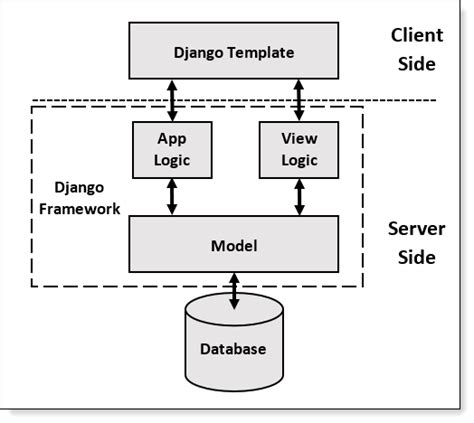
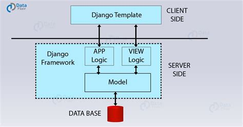

<!-- PROJECT LOGO -->
 

  

  <h3 align="center">SecuriTree</h3>

  

    EPI-USE Labs Recruiting Exercise
     

<!-- TABLE OF CONTENTS -->

  
Table of Contents

  <ol>
    <li><a href="#about-the-project">About The Project</a></li>
    <li><a href="#built-with">Built With</a></li>
    <li><a href="#getting-started">Getting Started</a></li>
    <li><a href="#usage">Usage</a></li>
    <li><a href="#architectural-diagram">Architecture Diagram</a></li>
    <li><a href="#license">License</a></li>
  </ol>

<!-- ABOUT THE PROJECT -->

## About The Project

SecuriTree is an access control management application that provides a visual tree view of the security and
access control units installed in a security system. This application will allow authorised security operatives
to monitor and manage each physical security and access control unit (areas, doors, elevators, floors, etc.),
at a client’s premises from one central location.

## Built With

Visual Programming Languages
  
    - [html and css](http://www.w3.org/)

Application Logic Programming Language
 
    - [Python](https://www.python.org/)

User Interface
    
    - [Web Page Interface](http://www.w3.org/)

Application Web Framework
    
    - Django [Django](https://docs.djangoproject.com)

## Getting Started

Detailed documentation is in the "docs" directory. This application has only been tested in a linux operating system. Though the application might run on Windows OS, there is no official support to it.

<!-- USAGE -->

## Usage

### View System Heirachy

### Door Management

### Creating an admin user

To create a user who can login to the admin site, run the following command:

    ``
    python manage.py createsuperuser
    ``

Now, open a web browser and go to “/admin/” on your local domain – e.g., http://127.0.0.1:8000/admin/ to access the admin dashboard.

## Architectural Diagram

Django is a high-level python-based free and open-source web framework that adapts and follows the model-template-views (MTV) architectural pattern. The diagram below represents the MTV architectural pattern.

The Model contains the logical file structure of the project and is the middleware & data handler between database and view. It defines data formats as well as storage and retrieval of data from the database.

Views act as a link between the Model data and the Templates. It communicates with the database and transfers data to the template for viewing.

Templates are responsible for the entire User Interface completely. It handles all the static parts of the webpage along with the HTML, which the browser displays and renders to the user.

The working of each component of the MTV Architecture is represented below.

<!-- LICENSE -->

## License

Distributed under the MIT License.