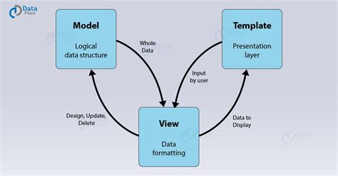

<!-- PROJECT LOGO -->
<br />
<p align="center">
  <a href="https://github.com/iamdanre/SecuriTree">
    
  </a>

  <h3 align="center">SecuriTree</h3>

  <p align="center">
    EPI-USE Labs Recruiting Exercise
    <br />

<!-- TABLE OF CONTENTS -->
<details open="open">
  <summary>Table of Contents</summary>
  <ol>
    <li><a href="#about-the-project">About The Project</a></li>
    <li><a href="#built-with">Built With</a></li>
    <li><a href="#getting-started">Getting Started</a></li>
    <li><a href="#usage">Usage</a></li>
    <li><a href="#architectural-diagram">Architecture Diagram</a></li>
    <li><a href="#license">License</a></li>
  </ol>
</details>

<!-- ABOUT THE PROJECT -->

## About The Project


SecuriTree is an access control management application that provides a visual tree view of the security and
access control units installed in a security system. This application will allow authorised security operatives
to monitor and manage each physical security and access control unit (areas, doors, elevators, floors, etc.),
at a client’s premises from one central location.

## Built With

- [html and css](http://www.w3.org/) : Visual Programming Languages

- [Python](https://www.python.org/) : Application Logic Programming Language

- [Web Page Interface](http://www.w3.org/) : User Interface

- Django [Django](https://docs.djangoproject.com) : Application Web Framework

## Getting Started

New to Django Framework? New to Python? Don't worry. We got you covered. If you are new to django and you want to install securiTree as a new application, we recommend you to follow the [New Application Installation](https://github.com/davymaish/django-SecuriTree/blob/master/docs/Requirement.md) guideline which will take you through the whole process fo installing a fresh Securitree Application.

If you have an existing Django Application and you would like to integrate SecuriTree Application into your project, don't worry too, we got you covered.  We recommend you to follow the [Instal Into An Existing Application](https://github.com/davymaish/django-SecuriTree/blob/master/docs/existing-application.md) guideline which will take you through the whole process fo installing Securitree Application into your project.

## Usage

Detailed documentation on SecuriTree Functional and Non-Functional Requirement can be found at [Requirement](https://github.com/davymaish/django-SecuriTree/blob/master/docs/new-application.md) file.

### View System Heirachy

The SecuriTree application allows an authenticated and authorised user to view all areas, doors and access rules in the client security system as a tree hierarchy.

### Door Management

The SecuriTree application allows a user to change the state of any door in the system between Locked and Unlocked. It has also an added functionality of viewing all doors through which a user can view all doors including their status and toggle between locking and unlocking.

### Super Admin User

This SecuriTree application has an added functionality of super admin user. This admin user is able to add and modify the application content using a user friendly and highly interactive admin dashboard.

To create a user who can login to the admin site, run the following command:

   ```sh
        python manage.py createsuperuser
   ```
Follow and answer all the question correctly. Once successful, open a web browser and go to “/admin/” on your local domain – e.g., http://127.0.0.1:8000/admin/ to access the admin dashboard.

The admin dashboard contain all system wide admin privelleges to manage the application entities and other admin level functionality.

## Architectural Diagram

Django is a high-level python-based free and open-source web framework that adapts and follows the model-template-views (MTV) architectural pattern. The diagram below represents the MTV architectural pattern.



The Model contains the logical file structure of the project and is the middleware & data handler between database and view. It defines data formats as well as storage and retrieval of data from the database.

Views act as a link between the Model data and the Templates. It communicates with the database and transfers data to the template for viewing.

Templates are responsible for the entire User Interface completely. It handles all the static parts of the webpage along with the HTML, which the browser displays and renders to the user.

The working of each component of the MTV Architecture is represented below.


## Why Django?

Django is a popular web framework among Python programmers for its excellent features which are and not limited to:

<ul>
    <li>Simple syntax as it adapts MTV (model-template-views) core architecture;</li>
    <li>It has “Batteries included” (comes with all the essentials needed to solve solving common cases);</li>
    <li>It has an ORM (Object Relational Mapper);</li>
    <li>It has HTTP libraries and Middleware support</li>
    <li>It is cross-platform, meaning that your project can be based on Mac, Linux or PC;</li>
    <li>It works with most major databases such as MYSQL and POSTGRESQL.</li>
    <li>It’s fast and simple and impliments the DRY philosophy </li>
    <li>Its secure and protect application from clickjacking, cross-site scripting,and SQL injection security attacks.</li>
</ul>

## License

Distributed under the MIT License.